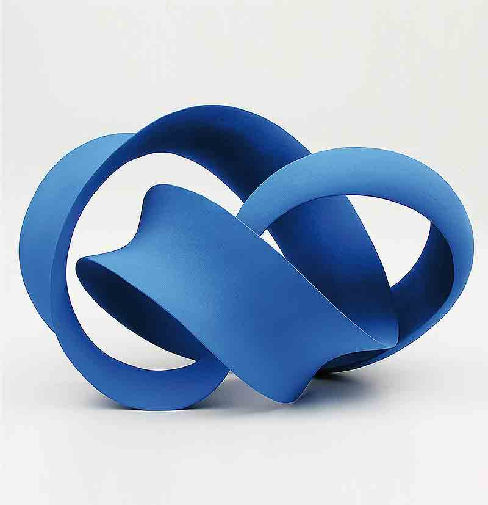

# Векторные расслоения. Hatcher

Чтобы объяснить определение векторного расслоения давайте рассмотрим касательные векторы к единичной сфере $S^2 \subset \mathbb{R}^3$ (Сфера -- это множество единичных векторов.). В каждой точке $x \in S^2$ определена касательная плоскость $P_x$. Это двумерное векторное пространство с нулевым вектором $\mathbf{0}_x$. Векторы из $P_x$ представляются как направленные отрезки с концами в $x$. Если относиться к $v_x \in P_x$, как к вектору в $\mathbb{R^3}$, то стандартным соглашением в линейной алгебре будет отнести $v_x \in P_x$ к классу эквивалентности всех векторов получающихся параллельным переносом, к которому в частности относится вектор $\tau(v_x)$ с концом в начале координат $\mathbb{R}^3$. Соотношение $v_x \mapsto \tau(v_x)$ определяет отображение $\tau: TS^2 \to \mathbb{R}^3$, где $TS^2$ -- множество всех касательных векторов к $S^2$. $\tau$ сюръективна, но, конечно, не инъективна, так как прообразом каждого вектора в $\mathbb{R}^3$ является большая окружность сферы. С другой стороны отображение $TS^2 \to S^2\times \mathbb{R}^3: v_x \mapsto (x, \tau(v_x))$ инъективно и может быть использовано, чтобы определить топологию на $TS^2$, как на подпространстве $S^2\times \mathbb{R}^3$, состоящем из пар $(x, v)$, где $x \in S^2$ и $v \perp x$. (Как описать построение гомеоморфизма, чтобы я ничего не поняла.)

Таким образом $TS^2$, во-первых, топологическое пространство, а во-вторых, дизъюнктное объединение всех векторных пространств $P_x$ для всех $x \in S^2$. Можно представлять $TS^2$ как непрерывное семейство векторных пространств параметризированное точками на сфере.

Наиболее простое непрерывное семейство двумерных векторных пространств -- это, конечно, прямое произведение $S^2\times \mathbb{R}^2$. Является ли $TS^2$ этим пространством? Более точно, можно задаться вопросом, существует ли гомеоморфизм $h: TS^2 \to S^2\times \mathbb{R}^2$, который переводит каждую плоскость $P_x$ в плоскость $\{x\}\times \mathbb{R}^2$ с помощью изоморфизма векторных пространств. Если бы имелось такое отображение $h$, то для каждого фиксированного ненулевого вектора $v \in \mathbb{R}^2$ семейство векторов $v_x = h^{-1}(x, v)$ являлось бы непрерывным полем касательных векторов к $S^2$. В алгебраической топологии существует теорема, показывающая, что такого векторного поля не существует $\para 2.2$. Поэтому $TS^2$ по-настоящему `twisted` (изощренное) пространство, а не просто новое представление $S^2 \times \mathbb{R}^2$.

Уменьшая размерность, можно рассмотреть пространство $TS^1$ касательных векторов к единичной окружности $S^1 \in \mathbb{R}^2$. В этом случае существует непрерывное поле ненулевых касательных векторов, получаемое рассмотрением точек окружности, как комплексных чисел, и считая $v_x$ переносом вектора $ix$ с концом в $x$. Таким образом получаем гомеоморфизм $S^1 \times \mathbb{R} \to TS^1: (x, t) \mapsto tv_x$ c $\{x\}\times \mathbb{R}$, переходящим в касательную прямую, проходящуюю через $x$, посредством изоморфизма. Таким образом, $TS^1$ действительно эквивалентно $S^1\times \mathbb{R}^1$.

Переходя к $S^3$, получаем, что $TS^3$ опять же эквивалентно произведению $S^3\times \mathbb{R}^3$. Рассматривая $\mathbb{R}^4$ как кватернионы, эквивалентностью будет гомеоморфизм $S^3\times \mathbb{R}^3 \to TS^3$ переводящий $(x, (t_1, t_2, t_3))$ в вектор параллельный $t_1i x + t_2 j x + t_3 k x$ с концом в $x$. Аналогичная конструкция использующая октонианы Кэли показывает, что $TS^7$ эквивалентно $S^7\times \mathbb{R}^7$. Довольно глубокая теорема, доказанная в $\para 2.3$, показывает, что $S^1, S^3$ и $S^7$ единственные сферы, касательное расслоение которых эквивалентно прямому произведению.

Хотя $TS^n$ обычно не эквивалентно $S^n\times \mathbb{R}^n$, в некотором смысле это верно локально. Рассмотрим случай двумерной сферы. Для точки $x \in S^2$ обозначим за $P$ плоскость, проходящую через начало координат, полученную параллельным переносом $P_x$. Для точек $y \in S^2$ достаточно близких к $x$ отображение $\pi_y: P_y \to P$, отображающее касательный вектор $v_x$ в ортогональную проекцию $\pi_y(v_y)$ на $P$, является изоморфизмом. На самом деле это верно для любой точки, находящейся с той же стороны от $P$, что и $y$. Таким образом, для любого $y$ из подходящей окрестности $U$ точки $x$ отображение $(y, v_y) \mapsto (y, \pi_y(v_y))$ является гомеоморфизмом подпространства $TS^2$, состоящего из касательных векторов к точкам из $U$, и произведения $U\times P$. Более того сужение этого гомеоморфизма на $\{y\}\times P_y$ является изоморфизмом $P$ и $P_y$. Для обобщения этой конструкции удобно взять $p: TS^2 \to S^2: (x, v_x) \mapsto x$. В таком случае имеется гомеоморфизм $p^{-1}(U)$ и $U \times P$, который в ограничении на $p^{-1}(y) \to \{y\}\times P$ является изоморфизмом для каждого $y \in U$. С этим наблюдением можно приступить к формальному определению векторного расслоения.

## Базовые определения и конструкции

*В этой книге отображение всегда непрерывно. А множество, если не указано иное, -- топологическое пространство.*

*$n$-мерное векторное расслоение* -- это отображение $p: E \to B$ вместе со структурой  векторного пространства на $p^{-1}(b)$ для каждого $b \in B$, такое что выполнено условие локальной тривиальности: существует открытое покрытие $B$ множествами $\{U_{\alpha}\}$, для каждого из которых существует гомеоморфизм $h_{\alpha}: p^{-1}(U_{\alpha}) \to U_{\alpha}\times \mathbb{R}^n$, такой что отображение $p^{-1}(b) \to \{b\}\times \mathbb{R}^n$ является изоморфизмом для $b \in U_{\alpha}$. Такое $h_{\alpha}$ называется *локальной тривиализацией* (*local trivialization*) векторного расслоения. Пространство $B$ -- *база*, $E$ -- *тотальное пространство*, векторные пространства $p^{-1}(b)$ -- *нити* (*fibers*). Часто, когда $p$ понятно из контекста, векторным расслоением называется пространство $E$.

Вместо $\mathbb{R}$ можно взять $\mathbb{C}$. Полученное пространство -- *комплексное векторное расслоение*. В этой главе будут рассматриваться вещественные векторные расслоения. Чаще всего случай комплексных пространств полностью аналогичен.

### Примеры

#### 1. Тривиальное расслоение

$E = B\times \mathbb{R}^n$, $p$ -- проекция на первый множитель.

#### 2. Расслоение Мёбиуса

Пусть $E$ -- фактор-пространство $I \times \mathbb{R}$ по отношению эквивалентности $(0, t) \sim (1, -t)$. Тогда проекция $I \times \mathbb{R} \to I$ индуцирует отображение $p: E \to S^1$, которое является одномерным векторным расслоением. Так как $E$ гомеоморфно ленте Мёбиуса без края, $E$ называется *расслоение Мёбиуса*.

#### 3. Касательное расслоение сферы $S^n \subset \mathbb{R}^{n + 1}$

Векторное расслоение $p: E \to S^n$, где $E = \{(x, v) \in S^n\times \mathbb{R}^{n + 1}|\,\,\,\,v \perp x\}$ (вектор $v$ можно считать касательным к $S^n$, если взять паралелльный перенос с концом в $x$). $p: E \to S^n: (x, v) \mapsto x$. Чтобы построить локальные тривиализации, надо выбрать точку $x \in S^n$ и взять в качестве $U_x$ полусферу, содержащуюю $x$ и ограниченную плоскостью, проходящей через начало координат и перпендикулярной $x$. Определим $h_x: p^{-1}(U_x) \to U_x \times p^{-1}(x) \cong U_x \times \mathbb{R}^n$, следующим образом: $(y, v) \mapsto (y, \pi_x(v))$, где $\pi_x$ -- ортогональная проекция на $p^{-1}(x)$. $h_x$ локальная тривиализация, так как $h_x$ ограничивается до изоморфизма векторных пространств $p^{-1}(x)$ и $p^{-1}(y)$ для каждого $y \in U_x$.

#### 4. Нормальное (тангенциальное / перпендикулярное) расслоение сферы

$p: E \to S^n$, где $E$ состоит из пар $(x, v) \in S^n \times \mathbb{R}^{n + 1}$, где $v = tx, \,\,\,\, t \in \mathbb{R}$. Отображение $p$ опять же $(x, v) \mapsto x$. Как и в предыдущем примере $h_x: p^{-1}(U_x) \to U_x \times \mathbb{R}$ получается взятием ортогональной проекции $p^{-1}(y)$ на $p^{-1}(x)$ для каждого $y \in U_x$.

#### 5. Расслоение проективного пространства

Вещественное проективное пространство $\mathbb{R}P^n$ -- это множество прямых в $\mathbb{R}^{n + 1}$, проходящих через начало координат. Так как каждая такая прямая пересекает единичную сферу в двух противолежащих точках, можно относиться к $\mathbb{R}P^n$, как к фактору сферы по эквивалентности противоположных точек. *Каноническое расслоение* $p: E \to \mathbb{R}P^n$, где $E$ подмножество $\mathbb{R}P^n \times \mathbb{R}^{n + 1}$, состоящее из пар $(l, v), \,\,\,\, v \in l$ и $p(l, v) = l$. Локальные тривиализации опять же получаются взятием ортогональной проекции.

Существует бесконечномерное проективное пространство $\mathbb{R}P^{\infty}$, которое является объединением конечномерных проективных пространств $\mathbb{R}P^n$ с включением $\mathbb{R}P^n \subset \mathbb{R}P^{n + 1}$, получаемым из стандартного включения $\mathbb{R}^{n + 1} \subset \mathbb{R}^{n + 2}$. Топология на $\mathbb{R}P^{\infty}$ слабая или топология прямого предела, для которой множество в $\mathbb{R}P^{\infty}$ открыто, тогда и только тогда когда для любого $n$ его пересечение с $\mathbb{R}P^n$ открыто в $\mathbb{R}P^n$. Включения $\mathbb{R}P^n \subset \mathbb{R}P^{n + 1}$ индуцируют соответствующие включения расслоений, а объединение полученных расслоений образует расслоение $\mathbb{R}P^{\infty}$.

#### 6. Касательное расслоение проективного пространства

Каноническое расслоение $\mathbb{R}P^n$ имеет ортогональное дополнение, пространство $E^{\perp} = \{(l, v) \in \mathbb{R}P^n\times \mathbb{R}^{n + 1}| \,\,\,\, v \perp l\}$. Проекция $E^{\perp} \to \mathbb{R}P^n: (l, v) \to l$. Нити -- это ортогональные к $l$ пространства размерности $n$. Локальные тривиализации опять же ортогональная проекция.

Естественное обобщение $\mathbb{R}P^n$ -- это *многообразие Грассмана* или *грассманиан* $G_k(\mathbb{R}^n)$, состоящее из всех $k$-мерных гиперплоскостей, проходящих через начало координат $\mathbb{R}^n$. Топология этого пространства будет точно определена в $\para 1.2$ вместе с каноническим $k$-мерным векторным расслоением, состоящим из пар $(l, v)$, где $l$ точка в $G_k(\mathbb{R}^n)$ и $v$ вектор в $l$. Это расслоение также имеет ортогональное $n - k$-мерное расслоение.

*Изоморфизм* векторных расслоений $p_1: E_1 \to B$ и $p_2: E_2 \to B$ над одной базой $B$ -- это гомеоморфизм $h: E_1 \to E_2$, являющийся изоморфизмом $p_1^{-1}(b)$ и $p^{-1}_2(b)$ для всех $b \in B$. Далее для изоморфных расслоений используется обозначение $E_1 \cong E_2$.

Например, нормальное расслоение $S^n$ изоморфно тривиальному расслоению $S^n \times \mathbb{R}$ с изоморфизмом $(x, tx) \mapsto (x, t)$. Касательное расслоение $S^1$ изоморфно тривиальному расслоению $S^1 \times \mathbb{R}: (e^{i\theta}, it e^{i\theta}) \mapsto (e^{i\theta}, t),\,\,\,\, e^{i\theta} \in S^1, \,\,\,\, t \in \mathbb{R}$.

Расслоение Мёбиуса из примера $2$ выше изоморфно каноническому расслоению над $\mathbb{R}P^1 \cong S^1$. $\mathbb{R}P^1$ заметается линией, поворачивающейся на угол $\pi$, так что векторы в этих линиях заметают прямоугольник $[0, \pi]\times \mathbb{R}$ с отождествленными концами $\{0\}\times \mathbb{R}$ и $\{\pi\}\times \mathbb{R}$. Отождествляются точки $(0, x)\sim (\pi, -x)$, так как поворот вектора на угол $\pi$ дает отрицание вектора.

### Сечения

*Сечение* векторного расслоения $p: E \to B$ -- это отображение (непрерывное) $s: B \to E$, сопоставляющее каждому $b \in B$ вектор $v(b)$ в нити $p^{-1}(b)$. Условие $v(b) \in p^{-1}(b)$ также может быть записано в виде $ps = \mathbb{1}$. Каждое векторное расслоение имеет каноническое *нулевое сечение*, состоящее из нулевых веторов в каждой нити. Часто сечением называется образ $s(B) \subset E$. Посредством $p \,\,\,\, s(B)$ гомеоморфно проецируется на $B$.

Иногда можно доказать неизоморфность расслоений, сравнивая дополнения нулевых сечений, так как каждый изоморфизм векторных расслоений должен переводить нулевое сечение в нулевое сечение, поэтому дополнения нулевых сечений должны быть гомеоморфны (?). Например, расслоение Мёбиуса неизоморфно тривиальному расслоению $S^1\times \mathbb{R}$, так как дополнение нулевого сечения расслоения Мёбиуса связно, но это не так для $S^1\times \mathbb{R}$. Противоположностью нулевого сечения будет являться сечение, чьи значения никогда не обращаются в ноль. Не все векторные расслоения имеют такое сечение. Рассмотрим, например, касательное расслоение к сфере. Здесь сечение -- это касательное векторное поле к сфере. Как будет показано в $\para 2.2$, сфера имеет нигде не обращающееся в ноль векторное поле, тогда и только тогда, когда $n$ нечетно. Из этого следует, что касательное расслоение сферы не изоморфно тривиальному расслоению, если $n$ четно, так как тривиальное расслоение очевидно имеет нигде не обращающееся в ноль векторное поле, а изоморфизмы векторных пространств переводят нигде не обращающееся в ноль сечения в нигде не обращающееся в ноль сечения.

На самом деле, $n$-мерное векторное расслоение $p: E \to B$ изоморфно тривиальному расслоению, тогда и только тогда когда оно имеет $n$ сечений $s_1, \ldots, s_n$, таких, что векторы $s_1(b), \ldots, s_n(b)$ линейно независимы в каждом $p^{-1}(b)$. В одну сторону это очевидно, так как тривиальное расслоение несомненно имеет такие сечения, а изоморфизм векторных расслоений переводит линейно независимые векторы в линейно независимые векторы. (? см. eng) В обратную сторону, если имеется $n$ линейно независимых сечений $s_i$, то отображение $h: B \times \mathbb{R}^n \to E$ определяемое как $h(b, t_1, \ldots, t_n) = \displaystyle \sum_{i} t_i s_i(b)$ -- линейный изоморфизм в каждой нити, и непрерывно, так как его композиция с локальной тривиализацией $p^{-1}(U) \to U \times \mathbb{R}^n$ непрерывно. (?) Следовательно $h$ изоморфизм по следующей лемме:

:::: {#lemma-0}

Непрерывное отображения $h: E_1 \to E_2$ между векторными пространствами над одной и той же базой $B$ -- изоморфизм, если $h$ переводит каждую нить $p_1^{-1}(b)$ в соответствующую нить $p_2^{-1}(b)$ с помощью изоморфизма.

*Доказательство:*

::::

Тут доказывается, что касательные расслоения $S^1, S^2, S^7$ изоморфны соответствующим тривиальным расслоениям сфер. Доказывается с помощью утверждения перед леммой.

### Прямые суммы

Имея два векторных расслоения $p_1: E_1 \to B$ и $p_2: E_2 \to B$ над одной базой $B$ можно построить третье векторное расслоение над $B$, такое что его нити над каждой точкой $B$ -- это прямые суммы нитей $E_1$ и $E_2$ над этой точкой. Это приводит к определению *прямой суммы* $E_1$ и $E_2$, как пространства $$E_1\oplus E_2 = \{(v_1, v_2)\in E_1\times E_2|\,\,\,\, p_1(v_1) = p_2(v_2)\}$$
В таком случае определена проекция $E_1\oplus E_2 \to B: (v_1, v_2) \mapsto p_1(v_1) = p_2(v_2)$. Нити этой проекции -- прямые произведения нитей $E_1$ и $E_2$, как и хотелось. Для относительно безболезненной проверки условия локальной тривиальности сделаем два наблюдения:

a. Пусть дано векторное расслоение $p: E \to B$ и подмножество $A \subset B$. Имеем $p: p^{-1}(A) \to A$ -- векторное расслоение. Это *ограничение* $E$ *на* $A$.
b. Пусть даны векторные расслоения $p_1: E_1 \to B_1$ и $p_2: E_2 \to B_2$. Тогда $p_1\times p_2: E_1\times E_2 \to B_1\times B_2$, также векторное расслоение с нитями произведениями $p_1^{-1}(b_1)\times p_2^{-1}(b_2)$. Так если имелись локальные тривиализации $h_{\alpha}: p_1^{-1}(U_{\alpha}) \to U_{\alpha}\times \mathbb{R}^n$ и $h_{\beta}: p_2^{-1}(U_{\beta}) \to U_{\beta}\times \mathbb{R}^m$, то $h_{\alpha}\times h_{\beta}$ -- это локальная тривиализация $E_1\times E_2$.

Если $B_1 = B_2 = B$, то ограничение $E_1\times E_2$ на диагональ $B = \{(b, b) \in B\times B\}$ -- в точности $E_1\times E_2$.

Прямое произведение двух тривиальных расслоений -- тривиальное расслоение, но прямое произведение нетривиальных пространств может являться тривиальным. Например, прямое произведение касательного и нормального расслоений над окружностью изоморфно тривиальному расслоению $S^n\times \mathbb{R}^{n + 1}$, так как элементы прямой суммы -- это тройки $(x, v, tx) \in S^n \times \mathbb{R}^{n + 1} \times \mathbb{R}^{n + 1}$ и отображение $(x, v, tx) \mapsto (x, v + tx)$ -- изоморфизм прямой суммы $E_1\oplus E_2$ и $S^n\times \mathbb{R}^{n + 1}$. Значит касательное расслоение над $S^n$ *стабильно тривиально*, то есть становится тривиальным после взятия прямой суммы с тривиальным расслоением.

Аналогично с касательным и нормальным расслоениями для $\mathbb{R}P^n$.

Прямая сумма расслоения Мёбиуса с собой -- тривиальное расслоение. (!)

### Внутренние произведения

*Внутреннее произведение* векторного расслоения $p: E \to B$ -- это отображение $\langle, \rangle: E\oplus E \to \mathbb{R}$, ограничение которого на каждую нить дает скалярное произведение (inner product), т.е. положительно определенную симметрическую билинейную форму.

:::: {#definition-0}

Пространство $X$ *паракомпактно*, если оно Хаусдорфово и для каждого открытого покрытия существует разбиение единицы, подчиненное этому покрытию, т.е. существует набор отображений $\varphi_{\beta}: X \to [0, 1]$, каждое из которых имеет носитель (замыкание множества, где $\varphi_{\beta}$ не равно нулю), содержащийся в некотором множестве открытого покрытия. Также выполняется условие, что сумма $\displaystyle \sum_{\beta} \varphi_{\beta} = 1$  и только конечное количество функций $\varphi_{\beta}$ ненулевые в окрестности каждой точки пространства $X$. Несложно построить такие функции с помощью леммы Урысона, если $X$ компактное хаусдорфово. Это будет сделано в дополнении к этой главе, там же будет приведен пример паракомпактного, но не компактного множества. Большинство множеств, появляющихся в алгебраической топологии паракомпактны.

::::

:::: {#statement-0}

Внутреннее произведение существует для векторного расслоения $p: E \to B$, если $B$ компактное Хаусдорфово или более общо паракомпактно.

*Доказательство:* Пусть $\{U_{\alpha}\}$ открытое покрытие $B$, для которого существуют локальные тривиализации $h_{\alpha}: p^{-1}(U_{\alpha}) \to U_{\alpha}\times \mathbb{R}^n$. Они могут быть использованы, чтобы перетащить стандартное скалярное произведение в $\mathbb{R}^n$ в $\langle\dot,\dot\rangle_{\alpha}$ на $p^{-1}(U_{\alpha})$. Внутренне произведение на всем $E$ получается следующим образом: $\langle v, w \rangle = \displaystyle \sum_{\beta} \varphi_{\beta} p(v) \langle v, w\rangle_{\alpha(\beta)}$, где $\{\varphi_{\beta}\}$ -- разбиение единицы подчиненное покрытию $\{U_{\alpha}\}$ с носителем $\varphi_{\beta}$, находящимся в $U_{\alpha(\beta)} \,\,\,\,\blacksquare$

::::

В случае комплексных векторных расслоений можно построить эрмитово скалярное произведение аналогичным образом.

В линейной алгебре можно показать, что векторное подпространство всегда является слагаемым прямой суммы, взяв его ортогональное дополнение. Далее будет показано, что соответствующий результат выполняется для векторных расслоений над паракомпактной базой. *Векторное подрасслоение* векторного расслоения $p: E\to B$ -- это подмножество $E_0 \subset E$, пересечение которого с каждой нитью -- векторное подпространство, такое что ограничение $p: E_0 \to B$ является векторным расслоением.

:::: {#statement-1}

Если $E \to B$ векторное расслоение над паракомпактной базой $B$ и $E_0 \subset E$ векторное подрасслоение, то существует векторное подрасслоение $E_0^{\perp} \subset E$, такое что $E \cong E_0\oplus E_0^{\perp}$.

*Доказательство:* По предыдущему утверждению выбираем внутреннее произведение, затем строим $E_0^{\perp}$, каждая нить которого состоит из векторов ортогональных к нити в $E_0$. Докажем, что $p_{|E_0^{\perp}}$ векторное расслоение. Если это так, то $E \cong E_0\oplus E_0^{\perp}$ при помощи изоморфизма $(v, w) \mapsto v + w$ по лемме 1.

Нужно проверить условие локальной тривиальности. (?) можем рассматривать конкретный слой. Так как $E_0$ векторное расслоение размерности $m$, например, существует $m$ линейно независимых сечений $s_1, \ldots, s_m$. Можно дополнить $s_1(b_0), \ldots, s_m(b_0)$ до $n$ векторов $s_1(b_0), \ldots, s_m(b_0), \ldots, s_n(b_0)$ сначала в нити $p^{-1}(b_0)$. Из непрерывности определителя следует, что в некоторой окрестности $b_0$ можно рассматривать те же векторы $s_1(b_0), \ldots, s_m(b_0), \ldots, s_n(b_0)$ и они так же будут линейно независимы. Используя ортогонализацию Грама-Шмидта в каждой нити этой окрестности можно получить ортогональный базис $s_1'(b_0), \ldots, s_m'(b_0), \ldots, s_n'(b_0)$. $s_i'$ непрерывны, что следует из формул для ортогонализации. Определим $h: p^{-1}(U) \to U \times \mathbb{R}^n$, так $h(b, s_i(b))$ -- это стандартный $i$-базисный вектор в $\mathbb{R}^n$.

::::

:::: {#statement-2}

Для каждого вектрного расслоения $p: E \to B$ над компактным Хаусдорфовым пространством $B$ существует векторное расслоение $E'$, такое что $E\oplus E'$ тривиальное расслоение.

*Доказательство:*

::::

### Тензорные произведения

### Локально тривиальные расслоения

## Классификация векторных расслоений

### Pullback расслоения

Будем обозначать классы изоморфизмов $n$-мерных векторных расслоений над $B$ через $\operatorname{Vect}^n(B)$. Компклексный аналог обозначается $\operatorname{Vect}_{\mathbb{C}}^n(B)$.

:::: {#statement-3}

Пусть $p: E \to B$ векторное расслоение. $f: A \to B$ -- отображение. Тогда существует векторное расслоение $p: E' \to A$ и отображение $f^{*}: E' \to E$, такие что $f': p'^{-1}(a) \to p^{-1}(b)$ изомоморфизм. Причем такое расслоение единственно с точностью до изоморфизма.

Если построено $E'$ и есть расслоение $p'': E'' \to B$ изоморфное $p: E \to B$ посредством $h$, то $E'$ подходит в качестве поднятия для $p'': E'' \to B$ с $F^{*} = f^{*}\circ h$. Поэтому имеется функция $f^{*}: \operatorname{Vect}(B) \to \operatorname{Vect}(A)$, переводящее класс изоморфности $E$ в класс изоморфности $E'$. Часто $E'$ обозначается $E$ и называется *индуцированное* $f$ расслоение или *pullback* $E$.

*Доказательство:* Явно строим pullback: $E' = \{(a, v) \in A \times E| \,\,\,\, f(a) = p(v)\}$. $p'(a, v) = a$ и $f'(a, v) = v$. Имеем $f'p = p'f$.

Пусть $\Gamma_f = \{(a, f(a)) \in A\times B\}$. Тогда $p'$ раскладывается в композицию отображение $E' \to \Gamma_f \to A: (a, v) \mapsto (a, p(v)) = (a, f(a)) \mapsto a$. Первое отображение $(a, v) \mapsto (a, p(v))$ -- это ограничение векторного расслоения $\mathbb{1}\times p: A\times E \to A \times B$ на $\Gamma_f$, а второе отображение $(a, f(a)) \mapsto a$ -- гомеоморфизм, поэтому их композиция $p'$ -- векторное расслоение. Совсем банально проверяется, что $f': p'^{-1}(a) \to p^{-1}(b)$ изомоморфизм.

::::

Pullback тривиального расслоения -- тривиальное расслоение.

Примеры pullback'ов:

1. Ограничение векторного расслоения на подмножество может быть рассмотрено как pullback относительно отображения включения.
2. Если $f: A \to B: a \mapsto b_0$, где $b_0$ -- фиксированная точка, то pullback -- это тривиальное расслоение $A\times p^{-1}(b)$.
3. Касательное расслоение сферы -- это pullback касательного расслоения проективной плоскости относительно отображения факторизации.
4. расслоение Мёбиуса
5. 

Простейшие свойства pullback'ов:

1. $(fg)^{*}(E) \cong g^{*}f^{*}(E)$
2. $\mathbb{1}^{*}(E) \cong E$
3. $f^{*}(E_1 \oplus E_2) \cong f^{*}(E_1)\oplus f^{*}(E_2)$
4. $f^{*}(E_1 \otimes E_2) \cong f^{*}(E_1)\otimes f^{*}(E_2)$

:::: {#theorem-0}

Пусть $p: E \to B$ -- векторное расслоение и отображения $f_0: A \to B$ и $f_1: A \to B$ гомотопны. Тогда $f_0^{*}(E)$ изоморфно $f_1^{*}(E)$, если $A$ компактное хаусдорфово или, более общо, паракомпактно. 

*Доказательство:* Пусть $F: A \times I \to B$ гомотопия $f_0$ и $f_1$. Тогда ограничения $F^{*}(E)$ на $A\times  \{0\}$ и $A\times \{1\}$ -- это $f_0^{*}(E)$ и $f_1^{*}(E)$. То есть теорема является следствием следующего утверждения:

::::

:::: {#statement-4}

Ограничения векторного расслоения $p: E \to A \times I$ на $A\times \{0\}$ и $A \times \{1\}$ изоморфны, если $A$ -- паракомпактно.

*Доказательство:*

::::

:::: {#corollary-0}

Гомотопическая эквивалентность $f: A \to B$ паракомпактных пространств индуцирует биекцию $f^{*}: \operatorname{Vect}^n(B) \to \operatorname{Vect}^n(A)$. В частности каждое векторное расслоение над стягиваемым пространством тривиально.

*Доказательство:* см. свойства и примеры pullback'ов 2.

::::

### Clutching functions

## Фан-вопрос

Можете ли вы по картинке в конференции Мёбиуса понять, что это за пространство? (Не сворачивая оторванный кусок бумаги:)

# Векторные расслоения. Мищенко-Фоменко

Эта мега круто.

# Векторные расслоения. Милнор-Сташеф

# Упражения